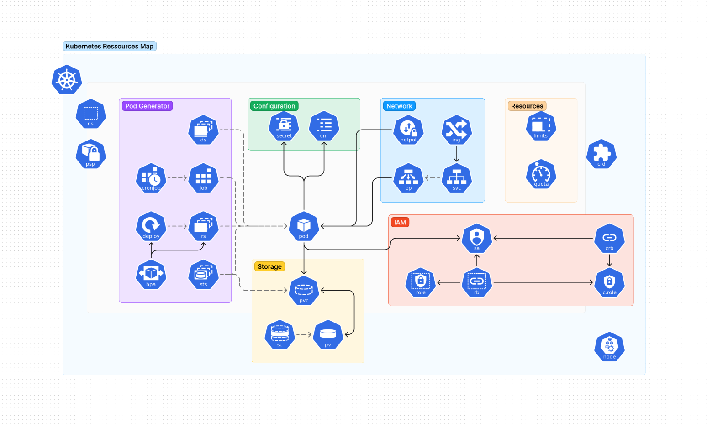

# hasura-chart <br> [](https://github.com/gmarcha/hasura-chart/actions/workflows/ci.yaml)

A Helm chart to deploy a Hasura application on Kubernetes.

[](https://kubernetes.io/docs/home/)
[](https://helm.sh/docs/)
[](https://graphql.org/learn/)
[](https://hasura.io/docs/latest/index/)
[](https://www.postgresql.org/docs/current/index.html)

## Example

[](https://gmarcha.github.io/hasura-chart/ )

## Requirements

- install `helm`,
- a running kubernetes cluster (see `/scripts`).

## Usage

```bash
helm repo add gmarcha https://gmarcha.github.io/hasura-chart/
helm install hasura gmarcha/hasura
```

## Tutorials

Run chart locally for development purpose:
```bash
git clone https://github.com/gmarcha/hasura-chart
cd hasura-chart
helm dependency build ./charts/hasura
helm install hasura ./charts/hasura
```

Use bash scripts in `/scripts/install` to install required tools:
- `bash scripts/install/helm.sh` to install `helm` cli,
- `bash scripts/install/kubectl.sh` to install `kubectl` cli (optional),
- `bash scripts/install/k3d.sh` to install `k3d` cli (optional)
- `bash scripts/install/docker.sh` to install `docker` for `k3d` usage.

Use scripts in `/scripts/cluster` to run a local k3d cluster:
- `bash scripts/cluster/create.sh` to create a cluster running on docker containers,
- `bash scripts/cluster/delete.sh` to delete cluster.

## Hasura

Hasura is a graphql engine which allows to generate a full-featured graphql server from postgres database schemas. Server handles queries, mutations and subscriptions out-of-the-box.

It also provides features to handle SQL migrations, fined-grained authorization on a row-level and open-api federation service. Nevertheless it doesn't support well graphql federation service, Postgraphile with graphql-mesh is better suited for this purpose.

## Author

[@gmarcha](https://github.com/gmarcha)

## License

[](https://opensource.org/licenses/Apache-2.0)
